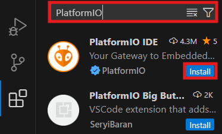

<!-- Pagination style -->

<!--Centered images -->

<!-- Title slide -->
# Formation

## Présentation et Installation de PlatformIO

---

### Sommaire 

**1. C'est quoi PlatformIO**
**2. Pk on utilise pa Ardouineau ???**
**3. Guide d'installation**

*Durée estimée de la formation : TODO*

Demandez à ChatGPT ou Wikipédia si vous comprenez pas un mot, flemme d'écrire un glossaire. 

--- 
<!--footer: "Section :  C'est quoi PlatformIO - Kézia Marcou | 2024" -->
## C'est quoi PlatformIO

### Généralités

PlatformIO est un **IDE** pour la programmation embarquée, qui permet d'utiliser différents **frameworks** tels que ESP-IDF, ST-Cube et en particulier **Arduino**.

[Explication officielle (en anglais)](https://docs.platformio.org/en/latest/what-is-platformio.html)

--- 

### Fonctionnalités

PlatformIO étant distribué sous la forme d'une extension [VSCode](https://code.visualstudio.com/), il est disponible sur Windows, Linux et Mac, et fonctionne de manière identique partout. 

L'IDE contient une quantité de fonctionnalités énorme, y compris du debug, de l'analyse de code automatisée, des tests unitaires etc. 

**Cette série de tutoriels permet uniquement d'apprendre les bases.**

--- 
<!--footer: "Section :  Pk on utilise pa Ardouineau ??? - Kézia Marcou | 2024" -->

## Pk on utilise pa Ardouineau ???

### Réponse rapide

Arduino IDE est un IDE destiné aux débutants, qui a été conçu pour être simple d'utilisation en cachant de la complexité. 

PlatformIO a été créé pour des professionnels, et contient bien plus de fonctionnalités et permet des manipulations plus précises. 

---

### Réponse très rapide 

J'aime pas Arduino IDE, il manque trop de choses. 

--- 
<!--footer: "Section :  Installation - Kézia Marcou | 2024" -->
## Installation de PlatformIO

### VSCode

Pour commencer, installer Visual Studio Code (AKA VSCode) depuis le site officiel : 

https://code.visualstudio.com/Download

VSCode a beaucoup de fonctionnalités dont je ne parlerai pas ici. 

---

### PlatformIO - étape 1

Lancer VSCode. Ouvrir le menu des extensions d'une des manières suivantes : 
- {Ctrl + Shift + X}
- {F1} puis tapez "Focus on extensions" et {Enter}
- Cliquer sur l'icône ci-dessous (à gauche) 

 

---

### PlatformIO - étape 2

Une barre de recherche devrait être apparue. Taper "Platformio" dedans, puis cliquer sur le bouton `Install` (ou `Installer`) à côté de l'extension "PlatformIO IDE". 

--- 

### PlatformIO - vérification

Redémarrez VSCode. 

Vous pouvez vérifier l'installation de 2 manières : 
- {F1} puis taper "PlatformIO Home" puis {Enter}
- Un icône est apparu en dessous de l'icône des extensions 

--- 

## That's all folks

### Ressources extérieures (en Anglais)

[Official documentation](https://docs.platformio.org/en/latest/integration/ide/vscode.html#ide-vscode)

[Why Use PlatformIO instead of Arduino? (youtube)](https://www.youtube.com/watch?v=iKLJv6rvpTs)

[PlatformIO: All you need to know in 10 Minutes!](https://www.youtube.com/watch?v=PYSy_PLjytQ)