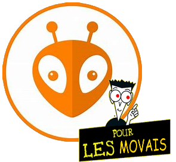

<!-- Pagination style -->

<!--Centered images -->

<!-- Title slide -->
# Formation

## Utilisation de base de PlatformIO

---

### Sommaire 

**1. Structure d'un projet PlatformIO**
**2. Création d'un projet**
**3. Ouvrir un projet récupéré**
**4. (optionnel) Modification de la structure d'un projet**

Demandez à ChatGPT ou Wikipédia si vous comprenez pas un mot, flemme d'écrire un glossaire. 

--- 
<!--footer: Section : Structure d'un projet PlatformIO - Kézia Marcou | 2024 -->
## Structure d'un projet PlatformIO

| Dossier | Utilité | 
| - | - |
| `src`| code principal |
| `lib` | librairies utilisateur | 
| `include` | compliqué... |
| `test` | tests unitaires |

--- 

### Dossiers importants : `src`

- src contient le programme principal. Dans le cas d'Arduino, c'est le fichier qui contient `setup()` et `loop()`. Il est conseillé de l'appeler `main.cpp`

Vous pouvez aussi placer d'autres fichiers `.cpp`/`.c` et `.h` dans ce dossier, mais c'est généralement déconseillé. 

--- 

### Dossiers importants : `lib`

- `lib` contient les librairies que vous avez écrites pour le projet, chacune dans un dossier.

Il s'agit des librairies *utilisateur*. Les librairies extérieures (écrites par quelqu'un d'autre) sont généralement ajoutées différement (voir formation suivante).

--- 

### Exemple de projet