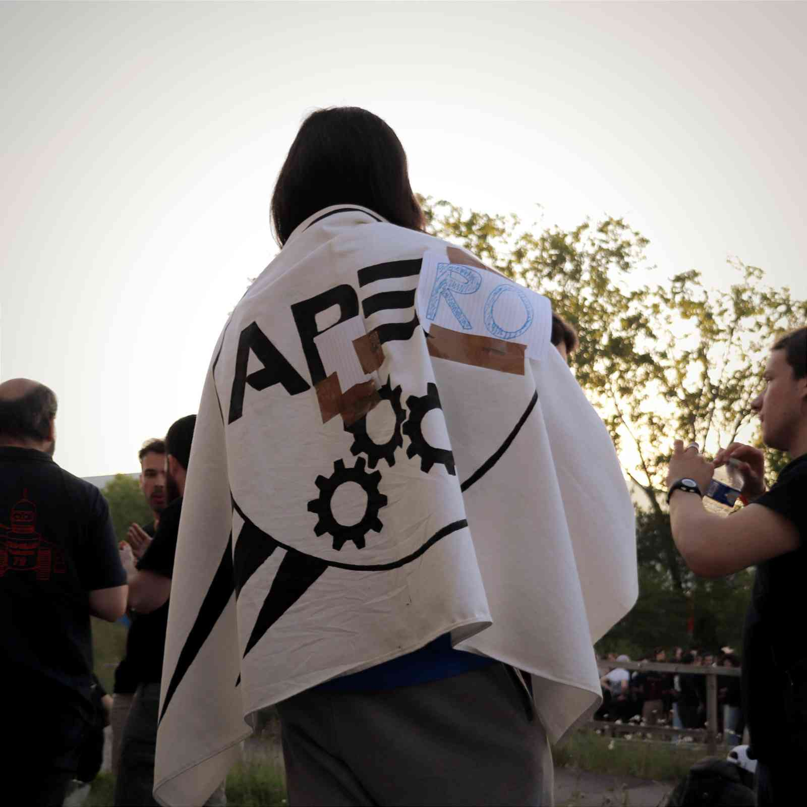

# PlatformIO pour les nuls

Ce repo contient un ensemble de tutoriels en français ayant pour objectif de permettre aux débutants d'installer et d'utiliser PlatformIO pour faire de la programmation embarquée. 

Il contient : 
* des présentations au format PDF, créées avec [Marp](https://marp.app/)
* des travaux pratiques (TP) pour appliquer les connaissances apprises dans les présentations
* des liens vers des ressources extérieures pour approfondir ces connaissances

---

## Sommaire du repo

### Installation et utilisation basique de PlatformIO
1. [Présentation et Installation](./Bases/Presentation_Installation/) (installation de l'IDE)
2. [Utilisation basique](./Bases/Utilisation_basique/) (compilation et envoi de code, ouverture et création de projets) \[Avec TP\]
3. [Gestion de librairies](./Bases/Gestion_de_librairies/) (gestion de librairies utilisateur et extérieures) \[Avec TP\]

### Bases de la programmation embarquée
1. [Concepts de base](./Prog_embarquee/Concepts_de_base/) (théorie pour comprendre ce qu'on fait) 
2. [Bases du framework Arduino avec PlatformIO](./Prog_embarquee/Bases_Arduino/) (pour ceux qui n'ont jamais utilisé Arduino)
3. [Différences entre PlatformIO et Arduino IDE](./Prog_embarquee/Comparaison_Arduino_IDE/) (pour ceux qui ont déjà utilisé Arduino)
4. [Utilisation d'un moteur et driver associé](./Prog_embarquee/Drivers_moteurs/) (le premier qui branche un moteur sur une STM32 paiera pour ses crimes)

*Remarque : les codes d'exemple seront fournis pour la carte [**ST Nucleo L432KC**](https://www.st.com/en/evaluation-tools/nucleo-l432kc.html), il est donc conseillé d'utiliser celle-ci si possible.* 

---

## Organisation des formations

Chaque formation est composée de : 
* une présentation (diaporama) au format PDF et Markdown (dans le dossier *support*)
* un README, à lire SVP...c'est pas si long
* (optionnel) un ou des projets platformIO, solutions des TP dans des dossiers séparés

---

## Mais c'est qui le con qui a conçu ces formations ?

C'est moi, si tu veux me remercier, paie moi une bière au tibbar.   
Longue vie à l'apéro <3

[feur](https://matias.ma/nsfw)